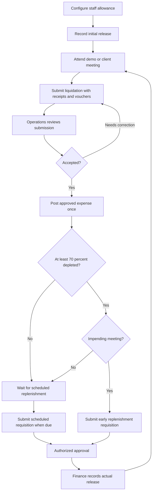

# Allowances & Requisitions — Additional Feature Implementation Plan

Status: implemented locally with automated verification. Production activation requires Firebase deployment, App Check, private bucket CORS, confirmed policy, verified staff grants, and reconciled opening balances. See [setup and verification](allowances-setup.md).

Prepared: October 4, 2026, Asia/Manila.

## 1. Objective and scope

Add an internal **Allowances & Requisitions** module to the existing ODC admin system. It will manage revolving allowances for staff attending demos or client meetings, expense liquidation with receipts and vouchers, Operations review, and replenishment requisition slips.

This is an additional feature. Keep the existing public website, client portal, invoicing, salary tracker, staff management, inventory, agreements, and other modules working. Do not turn the allowance into a salary component or replace the existing finance ledger.

The supplied requisition flowchart is the business requirement source. Recommendations and unresolved policy choices below are explicitly distinguished from its stated rules.

### Existing implementation reviewed

| Existing file / area | Finding | Planned integration |
| --- | --- | --- |
| `package.json` | React 19, Vite, React Router, Firebase SDK; build and lint scripts | Use the current stack and UI conventions |
| `src/App.jsx` | `/odc/*` renders the admin system | Keep the existing route; introduce an admin tab |
| `src/pages/Admin.jsx` | Admin modules render through `activeTab`; receive `firebaseUser`, `isSuperAdmin`, and `can` | Add the `allowances` tab and pass a resolved staff identity |
| `src/utils/navigationConfig.js` | Central module and action registry | Register the new module and its permissions |
| `src/pages/AdminStaff.jsx` | Staff permissions use `allowedTabs` and `allowedActions` | Add explicit feature grants and participant/reviewer presets |
| `src/pages/AdminSalaries.jsx` | Shares `staff`; salary payouts create linked `expenses` | Reuse staff identity only; keep allowance transactions separate |
| `src/pages/AdminClients.jsx` | Existing `clients` collection | Offer an existing-client selector plus a prospective-client name |
| `src/pages/AdminInvoices.jsx` | Existing expense ledger, finance reporting, and print patterns | Post approved meeting spending once; protect linked records |
| `src/lib/firebase.js` | Auth and Firestore are exported; Storage and Functions are not initialized | Add Storage and Functions exports for this module |
| `firestore.rules` | Many legacy collections permit any authenticated user to write; new collections currently fall through to deny | Add explicit feature rules and narrowly protect linked expenses |

No existing allowance, liquidation, or replenishment module was found. The reviewed source tree has no Firebase Functions implementation or Storage rules file; those are new infrastructure deliverables.

## 2. Business rules

| Requirement from the flowchart | Planned behavior |
| --- | --- |
| PHP 2,000 allowance for Roca and other staff who attend demos, sufficient for two meetings | Configure a PHP 2,000 target float per eligible staff member; select staff from the roster rather than hard-code a person |
| Strict PHP 1,000 per meeting | Validate the combined spending for one staff member and meeting, including revisions and multiple expense lines |
| Liquidate after every meeting / daily | Provide a Submit Liquidation button for each held meeting; show incomplete and overdue submissions |
| Attach all receipts and vouchers for each meeting | Require supporting evidence for each expense line and allow multiple files |
| Operations checks liquidation after every submission | Put every submitted slip into an Operations review queue |
| Below 70% depletion | Show “Wait for scheduled replenishment”; do not enable the early replenishment path |
| At least 70% depleted with impending client meetings | Enable an early replenishment requisition after review, with an upcoming meeting linked |
| Requisition date, reason naming the client, requester, money left on hand | Include these fields plus calculated balance and requested top-up |
| Liquidation date, client meeting, total spent, attachments | Include these fields plus itemized expenses and review history |
| PHP 200 gasoline for a standalone meeting; PHP 400 for multiple meetings in a day | Validate fuel per staff member and Manila calendar day; allocate shared daily fuel once across that day's meetings |

### Recommended defaults requiring business confirmation before activation

1. **Fuel is included in the PHP 1,000 meeting limit.** The source does not say whether fuel is additional. For two meetings, a PHP 400 shared fuel purchase can be allocated PHP 200 to each meeting without duplicating the purchase.
2. **Replenishment restores the float to PHP 2,000.** If verified cash is PHP 600, the proposed release is PHP 1,400, rather than another PHP 2,000.
3. **Early replenishment uses reviewed spending.** Pending or returned liquidation must be resolved before funds are released. A request can be prepared while review is pending.
4. **No self-approval.** Operations reviews liquidations; an authorized approver approves requisitions; an authorized Finance user records release. One person may hold multiple permissions but must not approve their own request.
5. **Due date is the meeting's Manila calendar day.** Submission remains possible after the due date and is marked late. There is no silently imposed 24-hour cutoff.
6. **No automatic transfer of money.** Approval and recorded cash/bank release are separate actions. Recording a release documents a payment that occurred outside the application.
7. **Routine replenishment is configurable.** The source mentions a replenishment date but supplies no schedule. Require an explicit next scheduled date; do not invent a weekly or monthly schedule.
8. **“Impending meeting” needs a configurable lead-time window.** Capture the upcoming meeting date immediately; configure the business-approved window before enabling early replenishment.

These choices do not block writing the module, but production activation must use agreed policy settings. Store a policy version on each transaction so later setting changes do not reinterpret old slips.

## 3. Workflow and states

### Record lifecycle

| Record | States | Balance effect |
| --- | --- | --- |
| Allowance account | `pending_setup`, `active`, `suspended`, `closed` | Configuration alone creates no cash; initial release credits the account |
| Meeting | `planned`, `held`, `cancelled` | Meeting planning does not deduct cash; cancellation does not erase an existing expense |
| Liquidation | `draft`, `submitted`, `returned`, `approved`, `voided` | Submission records reported spending; approval recognizes it as reviewed expense |
| Requisition | `draft`, `submitted`, `returned`, `approved`, `rejected`, `released`, `cancelled` | Only `released` increases cash |

Returned slips retain revision history and can be resubmitted. Approved slips and released requisitions are immutable. Corrections use linked, authorized reversals and replacement records; they do not overwrite history. A void requires a reason and cash reconciliation where money was actually spent. Do not restore money merely because Operations disputes a receipt.

Requisition approval does not release money. A changed balance, suspended account, expired eligibility, or newly unresolved liquidation requires revalidation at release; if the approved amount is no longer correct, return it for revision and approval.

## 4. Balance and eligibility calculations

Store new monetary values as integer centavos, with PHP formatting in the UI. Keep existing finance amounts in their current peso format and convert explicitly at the integration boundary.

- **Reviewed balance:** actual funds issued minus approved spending, cash returned to Finance, and applicable authorized adjustments.
- **Unreviewed reported spending:** money reported in submitted or returned slips that has not yet been approved. Resubmission replaces the outstanding amount rather than adding another deduction.
- **Estimated cash on hand:** reviewed balance minus unreviewed reported spending. Label it as estimated until Operations verifies it.
- **Verified depletion:** `(target float - reviewed balance) / target float`, subject to reconciliation and a valid positive target.
- **Top-up:** `target float - verified cash on hand`, with a minimum of zero and a maximum of the approved amount. Block release when cash is disputed or unreviewed spending remains.

Use the reviewed balance for the 70% early-replenishment decision, and display estimated cash separately so unreviewed spending does not make the allowance look spendable. Capture staff-declared physical cash on the slip and flag any discrepancy instead of overwriting calculated balances.

For the default PHP 2,000 target:

| Approved spending since restoration | Verified remaining cash | Depletion | Early request |
| --- | --- | --- | --- |
| PHP 1,000 | PHP 1,000 | 50% | Wait for the scheduled date |
| PHP 1,399.99 | PHP 600.01 | Below 70% | Wait for the scheduled date |
| PHP 1,400 | PHP 600 | 70% | Eligible if an impending meeting is linked |
| PHP 1,600 | PHP 400 | 80% | Eligible if an impending meeting is linked |

Use integer arithmetic for the threshold comparison. Recompute all balances and eligibility on the server at submission, approval, and release. Prevent negative cash spending, duplicate open requests, multiple active accounts for the same staff member, and account closure while cash or unresolved slips remain.

The PHP 1,000 limit applies cumulatively to the same meeting. The fuel limit applies cumulatively to the same staff member and Manila date. Retain a shared fuel purchase ID and explicit allocations so one receipt can support two meeting allocations without being charged twice. A single meeting cannot unlock the PHP 400 daily allowance merely by selecting “multiple meetings.”

## 5. Screens and forms

Add an **Allowances & Requisitions** navigation entry within `/odc`, with these sections:

| Section | Contents |
| --- | --- |
| My Allowance / Overview | Float, verified and estimated cash, depletion indicator, scheduled replenishment date, pending review, upcoming meetings, and clear next action |
| Meetings & Liquidations | Meeting log; New Meeting; Submit Liquidation; draft, submitted, returned, late, and approved filters |
| Operations Review | Review queue, itemized spend, receipt/voucher preview, cap validation, declared cash comparison, approve or return with comments |
| Replenishment Requests | New request, eligibility explanation, upcoming client meeting, amount, approval, and actual release tracking |
| History & Reports | Account ledger, printable slips, CSV export, monthly staff spending and replenishment history |
| Allowance Settings | Eligible staff, float, meeting and fuel caps, threshold, schedule, lead-time window, and policy version |

### Liquidation slip

Fields: slip number, allowance account, staff identity, meeting ID, meeting date, client ID when available, client-name snapshot, meeting purpose, submission date, expense lines, total spent, receipts and vouchers, reported remaining cash, and notes.

Each expense line contains category, description, amount, expense date, receipt/voucher references, and any shared fuel allocation. Total is calculated from lines. Enforce positive amounts, cap and balance checks, required evidence, completed uploads, and a held meeting before submission. Zero-spend meetings use an explicit no-expense confirmation and need no fabricated receipt.

Client selection must support prospects who do not yet have a client account. Preserve the client-name snapshot on each slip even if the client is later renamed or removed.

### Replenishment requisition slip

Fields: requisition number, date, requested by, account, request type (`early` or `scheduled`), reason such as `Meeting with "Client Name"`, linked upcoming meeting for early requests, verified balance snapshot, staff-declared money left on hand, proposed top-up, requested amount, review notes, approval identity/date, and release details.

Release details: actual amount, payment date, cash/bank method, reference or cash acknowledgment, released by, and recipient acknowledgment where applicable. A request records its creation date separately from the payment date.

Both slips support print and browser Save as PDF, with ODC branding, document number, status, totals, supporting-file list, and action history. Escape user-entered text in printable output. Receipt files remain private; do not expose a public slip URL.

Use existing modal and admin styling patterns, responsive tables, accessible labeled fields, upload progress, actionable errors, and disabled actions while saving. Preserve drafts on upload or save failure.

## 6. Proposed data model

Names below are proposed additions, not existing collections.

| Collection | Main fields / purpose |
| --- | --- |
| `allowancePolicies/{version}` | Target, meeting cap, fuel caps, threshold, timezone, due-date policy, lead-time window, effective date |
| `allowanceAccess/{authUid}` | Server-managed `staffId`, active status, explicit module actions and administrative scope |
| `allowanceAccounts/{staffId}` | Deterministic account ID; owner UID, staff snapshot, policy version, state, reviewed balance, unreviewed spending, next scheduled date, reconciliation state, active request ID |
| `allowanceMeetings/{id}` | Account/staff/owner, date, client link and snapshot, purpose, planned/held/cancelled state, cumulative spend |
| `allowanceLiquidations/{id}` | Account, meeting, owner, slip number, current revision, state, lines, total centavos, declared cash, review fields, linked expense ID |
| `allowanceRequisitions/{id}` | Account, owner, slip number, request type, meeting link, balance snapshot, requested/approved/released amounts, lifecycle fields |
| `allowanceLedger/{id}` | Immutable initial release, approved expenditure, replenishment, cash return, or reversal; account, signed amount, source ID, actor, timestamp |
| `allowanceAttachments/{id}` | Owner/account/slip/revision, Storage object path, original filename, MIME type, size, expense/fuel allocation references, upload-finalization state |
| `allowanceDailyFuel/{staffId_date}` | Daily shared purchase and allocated total; eligible held meetings; transactional cap enforcement |
| `allowanceAuditEvents/{id}` | Immutable actor UID, action, entity, revision, prior/new state, reason and server time |
| `allowanceCommandResults/{uid_commandId}` | Idempotency key, command type, result IDs, and payload digest to reject conflicting retries |

Add a `revisions` subcollection to liquidation documents for submitted versions and evidence manifests. Published policy versions and audit events are immutable. Store staff names as snapshots for history, but authorize using UIDs and server-managed mappings.

Use indexes supporting owner/account + submission date; status + submission date for Operations; account + ledger date; and staff/date meeting queries. Declare actual composite indexes in `firestore.indexes.json` after final queries are implemented. Paginate history and review queues instead of loading entire collections.

## 7. Permissions and server authority

Proposed navigation ID: `allowances`.

| Permission | Scope |
| --- | --- |
| `allowances:manage` | Configure accounts and policy; reconcile cash |
| `allowances:meeting` | Record own meetings |
| `allowances:liquidate` | Create, submit, and revise own liquidation slips |
| `allowances:review` | Review eligible staff liquidations; cannot review own |
| `allowances:request` | Submit own replenishment requisitions |
| `allowances:approve` | Approve or return requisitions; cannot approve own |
| `allowances:release` | Record actual initial funding and approved replenishment |
| `allowances:reports` | View authorized staff accounts and export reports |
| `allowances:reverse` | Correct posted records through audited reversals |

Recommended participant preset: meeting, liquidation, and requisition permissions with access to own records. Operations adds review and scoped reporting. Finance/approvers receive explicit approval or release actions as assigned. Do not automatically grant all new actions when a user gets the navigation tab, and do not grant new financial permissions through the legacy missing-`allowedActions` fallback.

**Required integration constraint:** current `staff` rules allow any authenticated user to write staff records. Consequently, copying `allowedActions` into the frontend cannot serve as authoritative approval permission for this feature. Keep a separate server-managed `allowanceAccess` collection with client writes denied. Bootstrap authorized feature administrators from deployment-managed UID configuration. The staff permissions UI calls an authorized backend operation to manage the new feature grants; it must not use writable staff fields or a `VITE_*` email list as the server's authorization source.

Link existing roster documents to Firebase Auth UIDs through a trusted migration/provisioning step. Staff documents currently use generated Firestore IDs and email matching; avoid assuming a staff document ID equals an Auth UID. Resolve duplicate or missing identity matches before enabling self-service. Do not copy passwords or full staff documents into allowance records or reports. Keep server authorization changes for this feature narrowly scoped.

### Backend commands

Add callable Firebase Functions for account configuration, explicit grants, meeting updates, attachment finalization, liquidation submission/review, requisition submission/approval/release, cash returns, and reversals. Every command checks authenticated UID, active trusted access, record ownership or authorized review scope, valid state transition, policy limits, and command idempotency. Include App Check enforcement in production configuration.

Use server-side Firestore transactions for authoritative balance updates and related records. All Functions paths must apply their own authorization; the privileged server SDK is not constrained by client Firestore rules. The browser never writes authoritative balances, final approval fields, ledger entries, expense postings, or audit events directly. Firestore transactions provide atomic multi-document updates. See [Firebase transaction documentation](https://firebase.google.com/docs/firestore/manage-data/transactions) and [callable function documentation](https://firebase.google.com/docs/functions/callable).

### Receipt and voucher storage

Add Firebase Storage initialization and `storage.rules`. Store objects under a module-specific path such as `allowances/{ownerUid}/{liquidationId}/{revision}/{fileId}`. Recommended upload policy: JPEG, PNG, WebP, and PDF; 10 MB per file; an explicit attachment count limit. Make both limits configurable before launch.

Allow upload only for owned editable slips. Finalize and validate the metadata before submission; uploaded but unreferenced files do not count as evidence. Prevent replacement or deletion of submitted evidence. Use authenticated file access or short-lived authorized retrieval rather than distributing persistent public download tokens. Restrict reviewer access using trusted feature grants. See [Firebase Storage security documentation](https://firebase.google.com/docs/storage/security).

Storage uploads and Firestore transactions are separate operations: upload first, validate/finalize, then submit. A failed transaction leaves the draft intact; clean up orphaned draft uploads after a defined grace period while retaining submitted evidence and revision history.

## 8. Integration with Invoices & Finance

Recognize company expense when a liquidation is approved. Initial funding and replenishment are cash advances tracked in the allowance ledger, and must not also be recorded as company spending in `expenses`.

On first approval, atomically create the reviewed expenditure, ledger entry, linked finance expense, audit event, and balance update. Use a deterministic expense ID such as `allowance_liquidation_{liquidationId}` and command idempotency to prevent duplicate posting on retries or concurrent approval.

The linked `expenses` record follows the existing shape: `title`, `category`, peso `amount`, `date`, `payee`, `referenceNumber`, `status`, `notes`, `createdAt`, `updatedAt`, and `createdBy`. Add `source: 'allowance_liquidation'`, `liquidationId`, `allowanceAccountId`, and approved line/category metadata. Initially use the existing `Other` category and a descriptive title; a dedicated finance category can be added after checking current charts and filters.

Display linked allowance expenses in the existing finance ledger, but route edits/corrections through this module. Add a targeted rules guard that denies client creation of reserved allowance-source records and denies update/deletion of linked records; also deny converting an ordinary expense into an allowance record or removing its reserved linkage. Preserve legacy handling for unrelated expenses. A correction transaction updates the linked finance projection to the corrected net expense while appending immutable reversal and replacement history to the allowance ledger.

Acceptance example: issue PHP 2,000, approve PHP 1,400 of meeting expenses, then release a PHP 1,400 top-up. The account returns to PHP 2,000, and the finance ledger contains PHP 1,400 of recognized expenses. The initial release and top-up remain visible in allowance cash movement reports.

## 9. Delivery phases

### Phase 1 — Policy and integration preparation

- Confirm the eight business defaults above, reviewers/approvers, file limits, and opening balances.
- Define detailed states, validation, reconciliation and exception handling; no over-cap override in the initial release unless the business explicitly approves one.
- Inventory Firebase project deployment configuration, Storage availability, Functions runtime, App Check, and emulator setup. Add the necessary configuration without changing the current Vite/Vercel application hosting.
- Establish trusted feature administrator UIDs, staff UID mappings, policy versions, and explicit grants.
- Deliverable: agreed policy, schema, permissions, commands, and migration checklist.

### Phase 2 — Backend and storage foundation

- Add Functions, command idempotency, transactional account and ledger operations, feature Firestore rules, Storage rules, indexes, attachment finalization, and audit events.
- Implement initial release, liquidation submission/review, replenishment approval/release, cash return, and correction commands.
- Add targeted finance linkage protections before any expense synchronization is enabled.
- Deliverable: emulator-verified authoritative workflow; no production records created.

### Phase 3 — Staff submission experience

- Register the new tab, explicit actions, and staff permission controls.
- Implement own-account overview, meetings, itemized liquidation, uploads, revision handling, late indicators, and replenishment forms.
- Add mobile layouts, upload/save recovery, and clear eligibility reasons.
- Deliverable: staff can complete the required forms against the verified backend.

### Phase 4 — Operations and Finance experience

- Implement review queue, receipt inspection, cash discrepancy handling, returned submissions, requisition approval, and actual release capture.
- Enable deterministic expense synchronization and protect linked expenses in existing finance UI.
- Add print/PDF slips, CSV export, audit history, daily fuel allocation view, and staff/month reports.
- Deliverable: end-to-end workflow with reconciled balances and expense totals.

### Phase 5 — Validation and controlled rollout

- Run the acceptance scenarios below, emulator security tests, frontend lint, and production build.
- Pilot with one eligible staff member, an Operations reviewer, and an authorized approver/Finance user.
- Reconcile any existing physical allowance cash and historical spending before setting opening values. Imported balances are explicitly labeled opening entries, not silently assumed to be PHP 2,000.
- Enable the feature for approved staff only, verify unrelated modules, and provide short staff/reviewer instructions.
- Deliverable: pilot sign-off and staged production activation.

## 10. Planned file changes

| File / directory | Change |
| --- | --- |
| `src/pages/AdminAllowances.jsx` | New feature entry and section orchestration |
| `src/components/allowances/` | Overview, meeting form, liquidation form, receipt uploader, review queue, requisition form, release form, history and print views |
| `src/hooks/useAllowances.js` | Scoped queries, listeners, pagination, and cleanup |
| `src/services/allowanceService.js` | Callable commands and attachment operations |
| `src/utils/allowanceCalculations.js` | Money formatting and UI preview calculations; server remains authoritative |
| `src/pages/Admin.jsx` | Add module renderer and trusted feature access resolution alongside existing module access |
| `src/utils/navigationConfig.js` | Add navigation metadata and explicit actions |
| `src/pages/AdminStaff.jsx` | Feature presets and authorized grant management |
| `src/pages/AdminInvoices.jsx` | Show linked expenses and route corrections to allowance workflow |
| `src/lib/firebase.js` | Export Storage and Functions clients |
| `functions/` | New server commands and shared validation |
| `firebase.json`, `firestore.indexes.json`, `storage.rules` | New Firebase deployment/emulator configuration, indexes, and file access rules |
| `firestore.rules` | New collection access and narrow linked-expense protections |

This table records the planned integration boundaries. Implementation now lives in the corresponding module, backend and configuration directories; operational details and the pre-push verification record are in `allowances-setup.md`.

## 11. Acceptance criteria

1. The module is additive: existing admin tabs, public pages, client portal, salary payouts, invoices, and unrelated expense CRUD continue to work.
2. Setting a PHP 2,000 allowance does not create spendable money until Finance records initial release; releasing twice through a retry credits only once.
3. A held meeting accepts up to PHP 1,000 combined spend; PHP 1,000.01 fails. Splitting lines or revising a slip cannot bypass the limit.
4. A standalone meeting permits at most PHP 200 fuel. Two or more eligible meetings permit at most PHP 400 fuel across the day, with each purchase and allocation counted once.
5. A positive-expense liquidation cannot submit without finalized receipt/voucher evidence. A zero-spend meeting can be explicitly closed without evidence.
6. Operations can review every submission, inspect evidence, and return it with a reason. Self-review is denied.
7. Pending and returned spending stays visible and reduces estimated cash; returning a receipt does not magically refund the employee.
8. At PHP 1,399.99 approved spending, early replenishment is disabled. At PHP 1,400 it becomes eligible only with an impending meeting within the configured window.
9. Below-threshold and no-upcoming-meeting accounts wait for their configured scheduled date; scheduled requests work when due. Reconciliation holds still prevent release.
10. With PHP 600 verified cash, the default top-up is PHP 1,400. Request submission and approval leave balances unchanged; actual release updates the balance once.
11. A stale approved request, changed cash balance, new unresolved liquidation, or suspended account cannot be released without revalidation.
12. Double submission, concurrent approval, retried Functions calls, and simultaneous release attempts produce one final transition, one expense, and one ledger effect.
13. Network/upload failures preserve drafts; finalized submitted files are immutable; orphan cleanup cannot remove submitted evidence.
14. Staff see only their own allowance records. Client-portal users, inactive staff, unrelated authenticated users, and users with forged frontend permissions cannot read private receipts or perform financial actions.
15. Direct writes to `staff.allowedActions`, tampered browser state, direct Firestore/Storage calls, and spoofed ownership fields cannot grant feature authority or alter balances.
16. Linked finance expenses cannot be edited, deleted, spoofed, or detached using existing client-side expense commands; unrelated finance workflows retain their behavior.
17. Approved spending posts once to Finance; cash advances and top-ups do not inflate expense totals. Authorized correction reconciles the net expense, cash, ledger, and audit history.
18. Missing/duplicate staff UID mappings, physical cash differences, cancelled meetings with expenses, negative-balance attempts, and closure with remaining cash receive explicit handling.
19. Date handling around midnight uses Asia/Manila consistently for meeting limits, overdue status, and scheduled eligibility; audit times remain server timestamps.
20. Printable slips include all flowchart fields and clear status, while private evidence stays protected. CSV output safely handles spreadsheet formula characters.

## 12. Rollout and rollback

Introduce a feature enable setting and explicit grants so deployment can precede activation. Deploy backend validation and rules before enabling the UI. Enable expense synchronization only after linked-expense protection is active.

Rollback disables new allowance actions and hides the new tab for participants while preserving read access for authorized reviewers and all receipts, audit events, ledger entries, and legitimate linked expenses. Do not delete new collections or remove protective rules to roll back the UI. Restore the prior application build if necessary without affecting existing modules.

Completion requires agreed policy, passing acceptance checks, reconciled opening balances, and pilot sign-off. Implementation and production deployment are separate from this documentation task.
